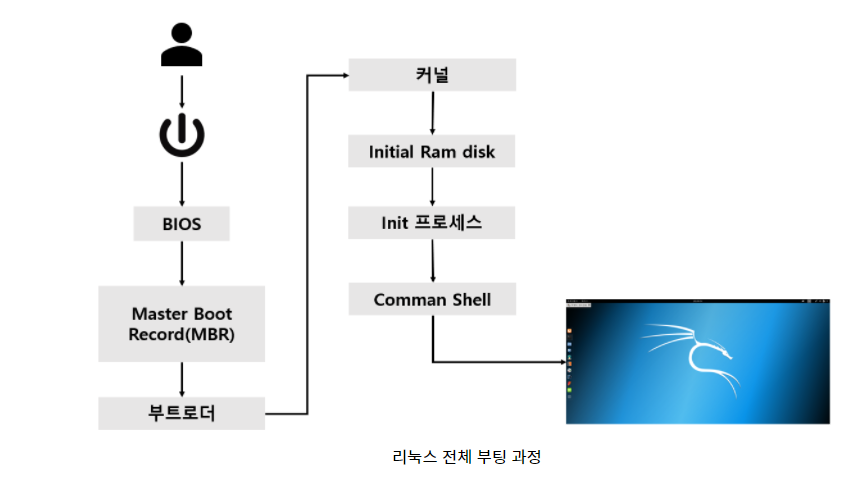

# Linux
## Linux shell
### What is sh?
``sh (or the Shell Command Language)`` is a programming language described by the [**POSIX standard**](https://pubs.opengroup.org/onlinepubs/009695399/utilities/xcu_chap02.html). It has many implementations ``(ksh88, Dash, ...)``. ``Bash`` can also be considered an implementation of sh (see below).

Because ``sh`` is a **specification**, not an implementation, **``/bin/sh`` is a symlink (or a hard link) to an actual implementation on most POSIX systems.**

### What is Bash?
Bash started as an **``sh``-compatible implementation** (although it predates the POSIX standard by a few years), but as time passed it has acquired many extensions. Many of these extensions may change the behavior of valid POSIX shell scripts, so by itself Bash is not a valid POSIX shell. Rather, it is a dialect of the POSIX shell language.

**Bash supports a ``--posix`` switch, which makes it more POSIX-compliant.** It also tries to mimic POSIX if invoked as ``sh``.

### sh = bash?
**For a long time, ``/bin/sh`` used to point to ``/bin/bash`` on most GNU/Linux systems.** As a result, it had almost become safe to ignore the difference between the two. But that started to change recently.

Some popular examples of systems where **``/bin/sh`` does not point to ``/bin/bash`` (and on some of which ``/bin/bash`` may not even exist)** are:

1. Modern Debian and Ubuntu systems, which **symlink ``sh`` to ``dash`` by default**;
2. ``Busybox``, which is usually run during the Linux system boot time as part of   ``initramfs``. It uses the  ``ash`` shell implementation.
3. ``BSD`` systems, and in general any non-Linux systems. ``OpenBSD`` uses ``pdksh``, a descendant of the ``KornShell``. FreeBSD's ``sh`` is a descendant of the original Unix Bourne shell. ``Solaris`` has its own ``sh`` which for a long time was not POSIX-compliant; a free implementation is available from the ``Heirloom project``.

**How can you find out what ``/bin/sh`` points to on your system?**
The complication is that ``/bin/sh`` could be a symbolic link or a hard link. If it's a symbolic link, a portable way to resolve it is:
```bash
# example
% file -h /bin/sh
/bin/sh: symbolic link to bash
# in case of my ubuntu linux
gusami@master:~$ file -h /bin/sh
/bin/sh: symbolic link to dash
```
If it's a hard link, try
```bash
# example
% find -L /bin -samefile /bin/sh
/bin/sh
/bin/bash
# in case of my ubuntu linux
gusami@master:~$ find -L /bin -samefile /bin/sh
/bin/sh
/bin/dash
```
In fact, the ``-L`` flag covers both symlinks and hardlinks, but the disadvantage of this method is that it is not portable — POSIX does not require ``find`` to support the ``-samefile`` option, although both ``GNU find`` and ``FreeBSD find`` support it.

### Shebang line
Ultimately, **it's up to you to decide which one to use, by writing the «shebang» line as the very first line of the script.**

E.g.
```bash
#!/bin/sh
```
will use ``sh`` (and whatever that happens to point to),

```bash
#!/bin/bash
```
will use ``/bin/bash`` if it's available (and fail with an error message if it's not). Of course, you can also specify another implementation, e.g.
```bash
#!/bin/dash
```
### Which one to use
For my own scripts, I prefer ``sh`` for the following reasons:
- it is standardized
- it is much simpler and easier to learn
- it is portable across POSIX systems — even if they happen not to have ``bash``, they are required to have ``sh``

There are advantages to using ``bash`` as well. Its features make programming more convenient and similar to programming in other modern programming languages. These include things like scoped local variables and arrays. **Plain ``sh`` is a very minimalistic programming language.**

## Boot sequence

- 자세한 내용은 [까망눈연구소 링크](https://wogh8732.tistory.com/72)를 참조 바람
  - Step 01: 바이오스
  - Step 02: 디스크에 있는 ``Master Boot Record``의 코드를 메모리로 로딩하고 수행
  - Step 03: ``Master Boot Record``는 실제 부트 로더를 로딩
  - Step 04: 부트 로더가 커널의 이미지를 메모리상에 로딩
  - Step 05: 커널이 수행할 여러가지 프로그램들과 드라이버들을 ``Init Ram Disk``라고하는 이미지를 가지고 Ram상에 가상으로 디스크를 생성
    - 기본적으로 시스템이 동작하게 됨
  - Step 06: 시스템이 동작하는 과정에서 제일 먼저 ``/sbin/init``라는 프로세스가 동작
    - 모든 프로세스들의 조상 프로세스
  - Step 07: ``/sbin/init`` 프로세스를 기준으로 기타 수행에 필요한 프로세스를 동작시킴
    - GUI와 관련된 프로세스도 기동해서 바탕화면이 보임

## Systemd란?
- init이 퇴출되고 init이 하던 작업을 물려받은 대단한 systemd 프로세스
- Systemd는 부팅부터 서비스관리 로그관리등의 시스템 전반적인 영역에 걸쳐있는 프로세스
- 부팅시에도 병렬로 실행되어서 상당히 부팅속도가 빨리짐

### 등장 배경
- 예전의 PID 1이었던 init은 현재로부터 수 십 년 전에 처음 소개된 프로그램인데 그 때의 구조를 거의 바꾸지 않고 계속 기능이 추가되며 날이 갈수록 복잡해지는 프로그램들로 인해 효율이 떨어졌습니다. 그리고 그 구조라는 것이 시작할 프로그램을 구동하는 쉘 스크립트를 특정 run-level의 rc 디렉토리에 추가하는 것이고, init은 부팅 과정에서 단계적으로 run-level을 올려가며 해당 run-level에 포함된 스크립트들을 순차적으로 실행시키니 설정의 난잡함 뿐만 아니라 속도마저 느렸습니다.
이런 문제들을 해결하기 위해 Red Hat에 근무하는 Lennart Poettering과 Kay Sievers란 사람들이  systemd를 만들기 시작했습니다. 이렇게 만들어진 systemd는 당연하지만 init보다 우월한 성능과 직관적인 설정을 가지게 되었습니다. 의존성을 해치지 않으며 가능한 한 병렬로 시작 프로그램들을 실행시키는 것으로 부팅 속도를 끌어올리고, 프로그램 실행을 위한 파일로는 쉘 스크립트가 아니라 .service라는 systemd만의 unit을 통해 체계적이면서 가독성이 좋게 설정이 가능해졌습니다.
게다가 systemd는 단지 init 뿐만 아니라 다른 프로그램들의 기능들마저 뺏어오기까지 합니다. 실제로 컴퓨터의 네임서버 주소를 설정하는 resolvconf의 자리를 systemd-resolved가, DHCP 서버에서 IP를 받아와서 네트위크 인터페이스에 설정하는 dhcpcd의 자리를 systemd-networkd가 대체할 수 있습니다. 이외에도 시스템 내부의 udev가 systemd에 포함되는 등 여러 방면에서 systemd의 존재가 강력해지고 있습니다. 이렇게 systemd가 여러 영역을 아우르는 것을 보고 혹자들은 하나만 잘하자 라는 UNIX의 철학에 어긋난다고 말하기도 합니다. 이건 제 개인적인 생각입니다만 UNIX 철학같은걸 따지기보다 실제 사용에 있어서 편리성과 앞으로의 발전 가능성을 보는 것이 더 바람직하다고 생각합니다. 그리고 systemd는 PID 1의 임무를 착실하게 수행하고 있으며 다른 부분에 대해서는 systemd-*의 이름으로 따로 존재하니 UNIX 철학에 너무 벗어나지 않는 것처럼 보이기도 합니다.

- 먼저 systemd 구성을 알아봅시다.
  - systemd : init 데몬
  - systemd-journald : 다른 데몬(프로세스)들의 출력(syslog, 표준, 에러 출력), 로그 저장 데몬
  - systemd-logind : 사용자 로그인, 세션 등 관리 데몬
  - systemd-udevd : 장치 관리자 데몬
  - systemd-networkd : 네트워크 관리 데몬. DHCP 뿐만 아니라 Virtual Lan 설정까지 가능
  - systemd-resolved : DNS 해석 데몬
  - systemd-timesyncd : NTP로 컴퓨터 시간 동기화 데몬
  - systemd-boot : UEFI 부트로더

- 데몬이나 systemd의 사용자 설정파일은 ``/etc/systemd/``에 존재
- 부팅속도 체크
```bash
# systemd-analyze
Startup finished in 288ms (kernel) + 714ms (initrd) + 15.430s (userspace) = 16.434s
```
```bash
# systemd-analyze blame
          2.509s network.service
          2.230s mariadb.service
           845ms kdump.service
           405ms postfix.service
           319ms lvm2-monitor.service
           244ms tuned.service
           125ms iprupdate.service
            95ms iprinit.service
```
### 정보
- 1번 프로세스id를 가지고 있음
```bash
#ps -p 1 ef
  PID TTY      STAT   TIME COMMAND
    1 ?        Ss     1:24 /usr/lib/systemd/systemd --switched-root --system --deserialize 23
```
- 설정 파일
  - ``/etc/systemd`` 디렉토리에 위치
```bash
#ls /etc/systemd
bootchart.conf  journald.conf  logind.conf  system  system.conf  user  user.conf
```
- 디렉토리 정보
```bash
/etc/systemd/ : configure
/lib/systemd/ : 바이너리 실행파일이 존재
/lib/systemd/system/ : Service, Target이 위치
```
### 서비스 제어
- 서비스 목록 확인
```bash
# systemctl list-unit-files
```
- 서비스 시작
```bash
# systemctl start [서비스명]
```
- 서비스 종료
```bash
# systemctl stop [서비스명]
```
- 서비스 재시작
```bash
# systemctl restart [서비스명]
```
- 서비스 활성화
```bash
# systemctl enable [서비스명]
```
- 서비스 비활성화
```bash
# systemctl disable [서비스명]
```
- 서비스 갱신
```bash
# systemctl reload [서비스명]
```
### 시스템 명령
```bash
# systemctl halt ( halt )
# systemctl reboot ( 리부팅 )
```
### 로그관리
- 로그는 systemd-journald를 통해 관리가 된다. 제어는 journalctl를 사용하면 된다.
- 이벤트 조회
```bash
# journalctl /sbin/crond
```
- 특정일자부터 이벤트로그 조회방법
```bash
# journalctl --since=today
```
- 이벤트 속성조회 ( debug, info, err 가능 )
```bash
# journalctl -p err
```
### 로그 설정
- 로그파일을 처리해주는 배치로 잘 관리하지 않을 경우에 아래와 같이 파일 사이즈와 기간을 설정
```bash
# vi /etc/systemd/journald.conf
SystemMaxUse=500M
MaxFileSec=1month
```

## Linux 명령어
### 명령어 도움말
  - 페이지 이동 방법
    - 이전 페이지 : page up 키 or b
    - 다음 페이지 : page down 키 or 스페이스바
    - 종료 : q
```bash
$ man 명령어
```
### nslookup
- 원하는 도메인의 ip 확인
```bash
$man nslookup    
NAME
       nslookup - query Internet name servers interactively

SYNOPSIS
       nslookup [-option] [name | -] [server]

DESCRIPTION
       Nslookup is a program to query Internet domain name servers.  Nslookup has two modes: interactive and non-interactive. Interactive mode allows the user to query name servers for
       information about various hosts and domains or to print a list of hosts in a domain. Non-interactive mode is used to print just the name and requested information for a host or
       domain.
```
- 사용예
```bash
gusami@master:~$nslookup www.daum.net
Server:		127.0.0.53
Address:	127.0.0.53#53

Non-authoritative answer:
www.daum.net	canonical name = www-daum-uj2suuqw.kgslb.com.
Name:	www-daum-uj2suuqw.kgslb.com
Address: 211.249.220.24
```
### tee
- 표준 입력에서 읽어서 표준 출력과 파일에 쓰는 명령어
```bash
$man tee
NAME
       tee - read from standard input and write to standard output and files

SYNOPSIS
       tee [OPTION]... [FILE]...

DESCRIPTION
       Copy standard input to each FILE, and also to standard output.

       -a, --append
              append to the given FILEs, do not overwrite

       -i, --ignore-interrupts
              ignore interrupt signals

       -p     diagnose errors writing to non pipes

       --output-error[=MODE]
              set behavior on write error.  See MODE below

       --help display this help and exit

       --version
              output version information and exit
```
- 사용예 1: 파일 생성
```bash
gusami@master:~$echo "hello" | tee hello.txt
hello
gusami@master:~$cat hello.txt
hello
```
- 사용예 2: 파일에 첨부하기
```bash
gusami@master:~$ echo "hello world" | tee -a hello.txt
hello world
gusami@master:~$ cat hello.txt
hello
hello world
```